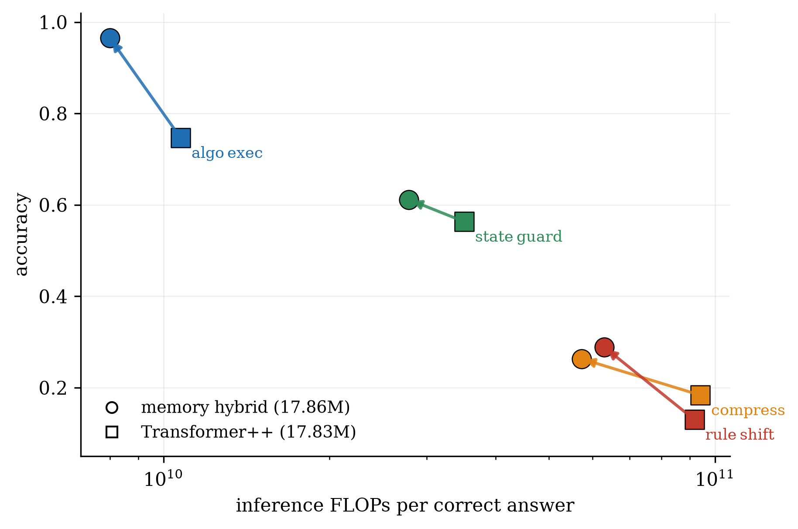
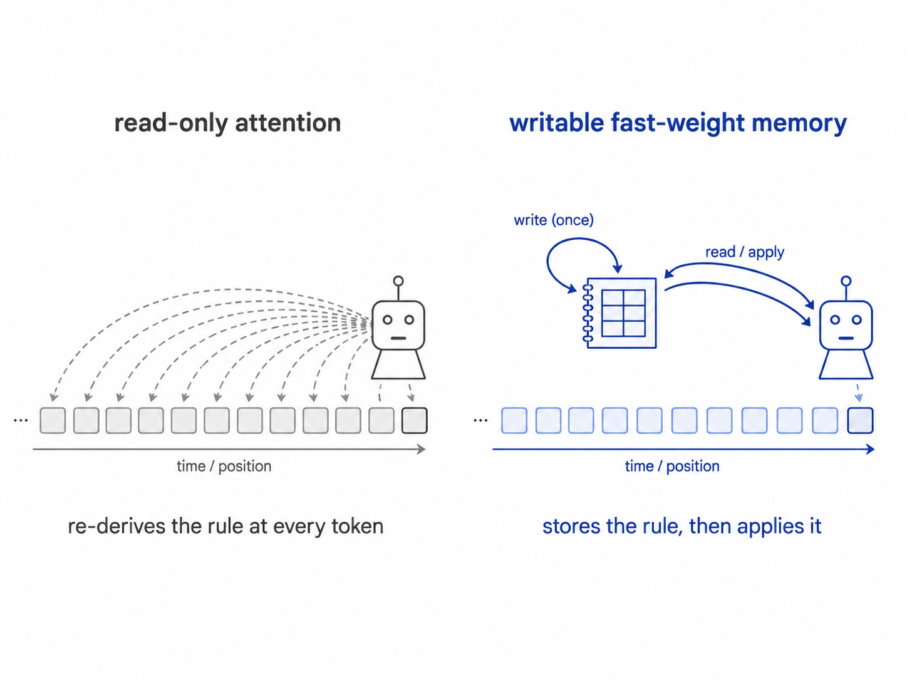
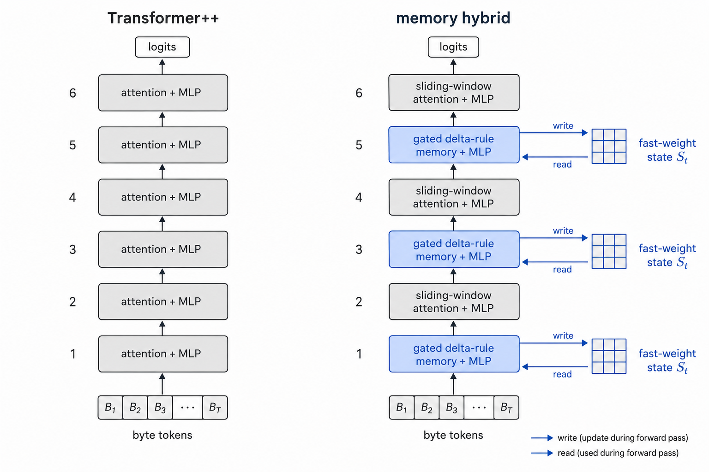

# Fast-Weight Memory Layers Improve Small Language Models at Matched Parameters and Compute

**Dimitar Stojanovski · Aware AI Labs · July 2026**

**Paper: [`paper.pdf`](paper.pdf)** · Full research program + run-level ledger: [aware-latent-depth](https://github.com/dimitri-sky/aware-latent-depth)



Replacing every second attention layer of a modern Transformer++ with a
**gated delta-rule fast-weight memory layer** makes an 18M-parameter language
model *more accurate on 5/5 procedural task families* (+4.0 to +21.8 points)
while spending **20–40% fewer inference FLOPs per correct answer** — at
parameters matched to 0.1%, identical data, matched training budget, and
pre-registered decision margins.

## Key findings

| finding | evidence |
|---|---|
| Wins on **5/5 families**, cheaper per correct answer | +21.8 algo_exec (Welch t=20.7), +7.9 compress (t=4.1), +15.8 rule_shift, +4.8 state_guard, +4.0 dsl_learn |
| It's the **delta mechanism**, not the sliding window | 2×2 ablation: delta +22.8, window +3.5, interaction −4.5 |
| **Not a fast-learner artifact** | 2× baseline training budget: gap remains +25.8 on hard tiers |
| Best density: **every 2nd layer** | sweep vs every-1st (cost-dominated) and every-3rd (−2.7, costlier per correct) |
| 50M scale: **task-dependent** | algo_exec gap grows to +31.7; state_guard reverses to −5.2 (fixed recipe; honestly caveated) |
| **Bimodal skill acquisition** | 1/6 seeds jumps discontinuously to 100% on rule_shift (0/6 baseline) |
| Negative control: **loops don't pay** | weight-tied recurrent depth failed matched-FLOP tests twice, incl. the 2026 recipe |

Total cost of the study: **~$38** of commodity cloud compute (RTX 5090).
Every number traces to a run_id; every experiment was pre-registered before
results existed.

## The idea in one picture

A standard Transformer is read-only at inference: it must re-derive any
newly-taught rule from raw context at every token. The delta-rule layer
maintains a writable fast-weight state — it stores the rule once, then applies
it.





## Try the demo (2 minutes)

From the [full repo](https://github.com/dimitri-sky/aware-latent-depth)
(checkpoints attached to its release):

```
python scripts/demo.py --family algo_exec --n 8 --difficulty 3
```

Fresh puzzles, both models side by side, live FLOPs-per-correct meter.
Typical output: memory hybrid 8/8 vs Transformer++ 5/8 — *"each correct
answer costs B2 1.66x what it costs AWARE."*

## Repository contents

```
paper.pdf         the paper (5 pages)
paper.tex         LaTeX source
figs/             all figures, vector PDF + 300-dpi PNG (scripts to regenerate
                  from the run ledger live in the full repo)
assets/           illustration prompts for figure generation
```

## Citation

```bibtex
@techreport{stojanovski2026fastweight,
  title  = {Fast-Weight Memory Layers Improve Small Language Models
            at Matched Parameters and Compute},
  author = {Stojanovski, Dimitar},
  year   = {2026},
  institution = {Aware AI Labs},
  url    = {https://github.com/dimitri-sky/fast-weight-memory-lm}
}
```

MIT License.
